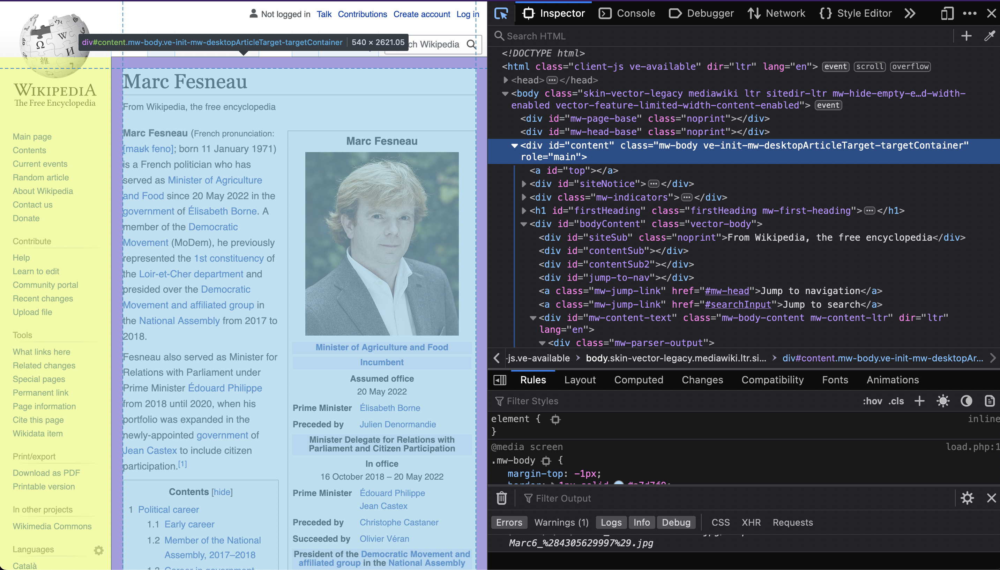

# An Opinionated Suggestion For Learning Simple Web Development

I was recently asked over Discord how to start learning web development. Despite our field becoming increasingly complicated as we chase increasingly more specific goals and technolgy features the basics are becoming easier and easier to learn. The following post is an almost verbatim copy of what I responded to that question asker. It's not a tutorial about <abbr title="HyperText Markup Language">HTML</abbr> or <abbr title="JavaScript">JS</abbr>. It's a suggested series of tasks to do to help learn things in a practical manner.

---

I know there's a lot to learn and it seems overwhelming at first. And it is! And continues to be! There's lots of things that I feel I need to learn still and I've been doing this 6+ years professionally. But you don't need to know all of it. I think there's an important set of ideas, skills and tech to get you started.

## Front End

A website is made of HyperText Markup Language - <abbr title="HyperText Markup Language">HTML</abbr>. <abbr title="Cascading Style Sheets">CSS</abbr> and <abbr title="JavaScript">JS</abbr> are optional. That's Cascading Style Sheets and JavaScript. The web was made for text content and we've gradually made it do more things. And more. And more and more and more.

<abbr title="HyperText Markup Language">HTML</abbr> is the skeleton of your webpage. It says there's a skull here, collar bone, ribs here, pelvis, legs, then feet bones.

<abbr title="Cascading Style Sheets">CSS</abbr> is the skin, clothing and whatnot. This changes how your webpage looks to users by building upon that intial structure.

<abbr title="JavaScript">JS</abbr> is like the muscles. It makes the body do things and move around, reacting to user behaviour.

Not every website or webpage needs <abbr title="JavaScript">JS</abbr>. Every page needs <abbr title="HyperText Markup Language">HTML</abbr>. <abbr title="Cascading Style Sheets">CSS</abbr> makes that <abbr title="HyperText Markup Language">HTML</abbr> easier and more pleasurable for users to read and ideally every page wants at least a little <abbr title="Cascading Style Sheets">CSS</abbr>.

I'd start with a simple webpage of text content. If you're looking for ideas click the <a href="https://en.wikipedia.org/wiki/Special:Random" class="animated-link">Random Article button on Wikipedia</a> and try to recreate the page content. For example I just got a random <a href="https://en.wikipedia.org/wiki/Marc_Fesneau" class="animated-link">French politician I've never heard of</a>.

You may be presented with a page that is more or less complicated than this. But here's how I break down Marc's page. The same can be done for any web page with a little practice and I've drawn boxes around parts of the page to break it down.

Try and recreate the part inside the red box.

Then try creating the part inside the blue box.

They don't have to neatly layout next to each other like in the screenshot, it doesn't need to respond to different browser window sizes, forget about other screen sizes for now.

You can do that with only a single index.html file (that's what we normally name the first html file) and view it in the browser directly. On Wdinows that might look like this file:///C:/Users/YOUR_USER/code/first-webpage/index.html. Adjust as appropriate.

And if you're hitting a dead end you can try inspecting the webpage. Open your <a href="https://developer.mozilla.org/en-US/docs/Learn/Common_questions/What_are_browser_developer_tools"  class="animated-link">browser dev tools</a> and get ready to be overwhelemed. Every web page can be viewed using these tools and you can discover how they were made. It's gotten harder due to how complex modern <abbr title="Cascading Style Sheets">CSS</abbr> and <abbr title="JavaScript">JS</abbr> developer tooling has become but if you have patience there's a lot to learn by inspecting the content of different websites.

For more information <a href="" class="animated-link">MDN</a> has everything you need to know.

## Back End

This should be easier if you've already learned some other languages. You can write backend server code in basically any language. If you know Java then stick with that. I mostly use Nodejs so I'm most familiar with that. I've made some <abbr title="Application Programming Interface">API</abbr>s in C# though and that was pleasant.

The technology doesn't matter so much. The concepts are the same for each language.

You have a server listening for requests on certain endpoints. They're defined by a <abbr title="Universal Resource Locater">URL</abbr> and a <abbr title="Hypertext Transfer Protocol">HTTP</abbr> verb. At first all you need to care about is GET, this is the one a browser uses when you visit a <abbr title="Universal Resource Locater">URL</abbr> for a webpage.

In your language of choice look up how to make a simple webserver. In Nodejs just choose express, it's the most popular and will do everything you need to do.

Start with 1 route that returns <abbr title="JavaScript Object Notation">JSON</abbr>.

Then multiple routes that each return different <abbr title="JavaScript Object Notation">JSON</abbr>.

Then a route that you provide arguments to. Look up GET parameters in your webserver framework docs and how to parse them.

Maybe your little backend can deliver the website of your front end? Then instead of using the file protocol file:///file_path etc you can visit http://localhost:3000 or whatever the port your backend is listening to.

The intro tutorial to the webserver you chose will take you through all this probbaly. <a href="http://expressjs.com/en/starter/installing.html" class="animated-link">Here's the one for express</a> but as I said pick whatever one is appropriate for whatever language you feel comfortable in.
